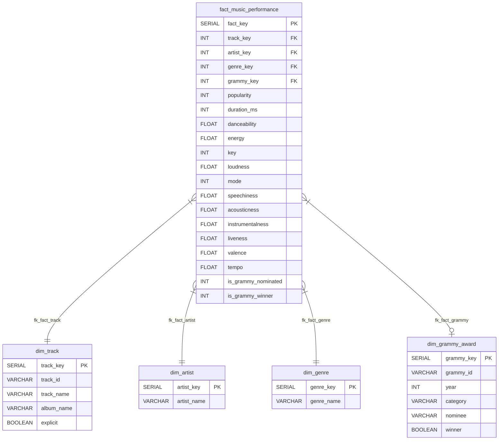
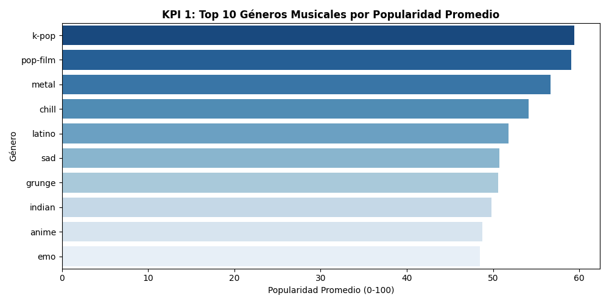
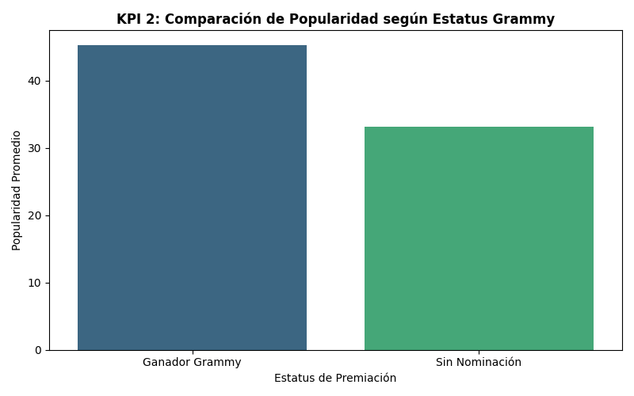
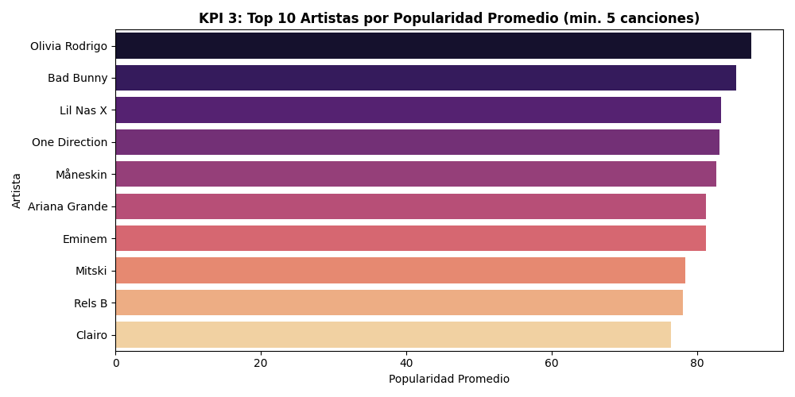
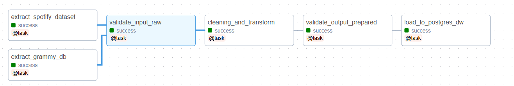

# Workshop 2: Data Pipeline & Data Warehouse para Análisis Musical (Spotify & Grammy Awards)

## 📌 Descripción del Proyecto
Este proyecto implementa una arquitectura de datos de extremo a extremo (ETL Pipeline y Data Warehouse) en PostgreSQL. El sistema integra dos fuentes de datos principales:
1. **Spotify Tracks Dataset**: Registros CSV con información de reproducciones, métricas de audio y metadatos de canciones.
2. **Grammy Awards Dataset**: Registro histórico almacenado en una base de datos relacional PostgreSQL con las nominaciones y ganadores de los Premios Grammy.

El objetivo analítico principal es evaluar la relación entre el desempeño comercial/características de audio de las canciones en plataformas de streaming y su reconocimiento por parte de la academia de premios Grammy.

---

## 🛠️ Tecnologías Utilizadas
* **Lenguaje:** Python 3.12
* **Base de Datos / DW:** PostgreSQL 16
* **Contenerización:** Docker & Docker Compose
* **Librerías Python:** `pandas`, `psycopg2`, `great_expectations`, `jupyter`
* **Entorno de Desarrollo:** Visual Studio Code (Jupyter Extension)

---

---


  ### 📊 Matriz de Análisis de Riesgos de Calidad de Datos (Data Quality Risk Matrix)

| Dataset / Attribute | Profiling Evidence | Potential Quality Risk | Related Requirement |
| :--- | :--- | :--- | :--- |
| **Spotify / `track_id`** | 24,259 registros duplicados por pertenecer a varios géneros. | Duplicación de métricas numéricas y sesgo en agregaciones del Data Warehouse. | **Transformación**: Deduplicación por `track_id` conservando el registro con mayor `popularity`. |
| **Spotify / `Unnamed: 0`** | Columna con índice secuencial redundante. | Ruido en los datos y desperdicio de almacenamiento. | **Limpieza**: Eliminación explícita de la columna. |
| **Spotify / `duration_ms`** | Registros con duración $\ge 0\text{ ms}$. | Posibles valores atípicos o muestras incompletas. | **Validación**: Expectativa automatizada $\ge 0\text{ ms}$. |
| **Grammy / `artist`** | 1,840 valores nulos/faltantes. | Pérdida de integridad referencial al enlazar con la dimensión Artista. | **Transformación**: Imputación con `'Varios / No especificado'`. |
| **Grammy / `workers`, `img`** | Presencia de nulos en metadata complementaria. | Fallos en el pipeline por valores `NULL`. | **Transformación**: Imputación con cadenas vacías `''`. |
| **Cross-Source / Matching** | Variaciones ortográficas y de formato entre ambas fuentes. | Fallos en los cruces (*joins*) entre fuentes. | **Estandarización**: Limpieza de cadenas (`trim`, minúsculas). |

---

#### 3. Validación Automatizada de Calidad con Great Expectations (Sección 6.3)
- **Creación del script `src/quality.py`**: Aplica validaciones automatizadas sobre ambas fuentes:
  - **Integridad**: No nulidad en `track_id` (Spotify) y `year` (Grammy).
  - **Rangos Numéricos**: Popularidad (popularity entre 0 y 100) y duración (duration_ms >= 0).
  - **Cobertura Temporal**: Rango de años en Grammy (year entre 1950 y 2030).

---

#### 4. Diseño del Modelo Dimensional (Sección 6.4)
- [x] **Definición formal de la arquitectura bajo la metodología Kimball**:

| Decisión de Diseño | Contenido Requerido | Definición de Arquitectura |
| :--- | :--- | :--- |
| **Business Process** | Proceso del negocio | **Análisis de Desempeño Musical y Reconocimiento**: Evaluación de métricas de reproducción junto a reconocimientos históricos de la industria. |
| **Grain of the Fact Table** | Grano de la tabla de hechos | Un registro por `track_id` único de Spotify consolidado, asociado a su género principal y a su estado de premiación Grammy. |
| **Dimensions** | Contextos analíticos | • `Dim_Track` (`track_key`, `track_id`, `track_name`, `album_name`, `explicit`)<br>• `Dim_Artist` (`artist_key`, `artist_name`)<br>• `Dim_Genre` (`genre_key`, `genre_name`)<br>• `Dim_Grammy_Award` (`grammy_key`, `year`, `category`, `nominee`, `winner`) |
| **Measures** | Métricas numéricas | • `popularity`<br>• `duration_ms`<br>• Métricas de audio (`danceability`, `energy`, `valence`, `tempo`, etc.)<br>• `is_grammy_nominated` (1 / 0)<br>• `is_grammy_winner` (1 / 0) |
| **Keys and Relationships** | Claves primarias y foráneas | **Surrogate Keys** numéricas auto-incrementales en dimensiones y **Foreign Keys** en la tabla de hechos con integridad referencial (soportando `NULL` para canciones sin premios). |
| **Requirement Support** | Soporte analítico | Permite consultas cruzadas para comparar métricas de audio y popularidad por género según estado de premiación Grammy a lo largo del tiempo. |

---

## 6.4 Diseños del Modelo Dimensional (Dimensional Model Design)

### 1. Definición del Arquitectura Dimensional (Kimball)
Antes de diseñar la lógica final de transformación e integración, se definió el modelo dimensional objetivo a partir de los requerimientos analíticos del proyecto y los datos disponibles en las fuentes origen (`spotify_dataset.csv` y `raw_grammys` en PostgreSQL).

| Decisión de Diseño | Contenido Requerido | Definición de Arquitectura en el Data Warehouse |
| :--- | :--- | :--- |
| **Business Process** | Proceso del negocio | **Análisis de Desempeño Musical y Reconocimiento de la Industria**: Evaluación integrada de las métricas de reproducción/popularidad en plataformas de streaming junto con el historial de reconocimientos y galardones de la industria (Grammy Awards). |
| **Grain of the Fact Table** | Grano de la tabla de hechos | **Un registro por canción única de Spotify (`track_id`), asociada a su género principal y a su estado de premiación en los Grammy (si aplica)**. |
| **Dimensions** | Contextos analíticos descriptivos | • **`dim_track`**: Metadatos descriptivos de la canción (`track_id`, `track_name`, `album_name`, `explicit`).<br>• **`dim_artist`**: Entidad de artista (`artist_name`).<br>• **`dim_genre`**: Clasificación por género musical (`genre_name`).<br>• **`dim_grammy_award`**: Contexto del premio histórico (`year`, `category`, `nominee`, `winner`). |
| **Measures** | Métricas numéricas o hechos | • **Métricas continuas**: `popularity` (0-100), `duration_ms` (duración en ms), `danceability`, `energy`, `loudness`, `speechiness`, `acousticness`, `instrumentalness`, `liveness`, `valence`, `tempo`.<br>• **Indicadores booleanos/contables**: `is_grammy_nominated` ($1$ / $0$), `is_grammy_winner` ($1$ / $0$). |
| **Keys and Relationships** | Claves primarias, foráneas y estrategia de llaves | • **Surrogate Keys (Claves Sustitutas)**: Claves primarias numéricas auto-incrementales (`SERIAL PRIMARY KEY`) en todas las dimensiones (`track_key`, `artist_key`, `genre_key`, `grammy_key`).<br>• **Business Keys (Claves de Negocio)**: `track_id` (Spotify) y clave compuesta `(year, category, nominee)` (Grammy).<br>• **Foreign Keys**: `fact_music_performance` contiene las llaves foráneas hacia cada dimensión, permitiendo valores `NULL` en `grammy_key` para canciones que no tienen nominación/premio registrado. |
| **Requirement Support** | Soporte a requerimientos analíticos | Permite realizar consultas cruzadas y agregaciones SQL para comparar atributos de audio y niveles de popularidad entre canciones ganadoras/nominadas a los Grammy vs. no nominadas, desglosadas por género y evolución temporal a lo largo de los años. |

---


---

## 6.5 Reglas de Calidad de Datos y Diseño de Validación (Data Quality Rules and Validation Design)

Se convierten los riesgos identificados durante la fase de perfilamiento en **7 reglas explícitas de calidad de datos** aplicadas a lo largo de las capas del pipeline (Raw, Transformación y Carga al Data Warehouse).

### 1. Matriz de Reglas de Calidad (Data Quality Rules Matrix)

| Rule ID | Dataset / Layer | Attribute(s) | Quality Dimension | Quality Rule | Metric / Threshold | Severity | Related Requirement |
| :--- | :--- | :--- | :--- | :--- | :--- | :--- | :--- |
| **QR-01** | Spotify / Raw | `track_id` | **Completeness** | No deben existir registros con identificador principal nulo o vacío. | $0\%$ Nulos ($\text{Success} = 100\%$) | **Critical** | Identificación unívoca de entidades en dimensiones y llaves foráneas. |
| **QR-02** | Spotify / Raw | `popularity` | **Validity** | El índice de popularidad debe estar en el rango válido de la API de Spotify. | $0 \le \text{popularity} \le 100$ | **Critical** | Precisión en agregaciones y comparaciones de rendimiento comercial. |
| **QR-03** | Spotify / Raw | `duration_ms` | **Validity** | La duración de la canción en milisegundos debe ser un número no negativo. | $\text{duration\_ms} \ge 0$ | **Warning** | Evitar métricas atípicas o registros con errores de muestreo en streaming. |
| **QR-04** | Spotify / Clean | `track_id` | **Uniqueness** | Garantizar que el grano de la tabla limpia no tenga IDs de canción duplicados. | $0$ duplicados tras deduplicación por mayor popularidad. | **Critical** | Prevención de duplicación de métricas al cargar la tabla de hechos. |
| **QR-05** | Grammy / Raw | `year` | **Completeness / Validity** | El año del premio debe ser no nulo y dentro del periodo de premiaciones históricas. | No nulo y $1950 \le \text{year} \le 2030$ | **Critical** | Integridad del análisis temporal y filtrado por décadas. |
| **QR-06** | Grammy / Clean | `artist` | **Completeness** | Tratar registros de artistas ausentes para mantener la integridad referencial. | $0\%$ nulos post-imputación (`'Varios / No especificado'`). | **Warning** | Evitar pérdidas de filas al realizar el *join* con `Dim_Artist`. |
| **QR-07** | Integrated / DW | `track_key`, `artist_key`, `genre_key` | **Integrity** | Las claves foráneas en la tabla de hechos no deben romper la integridad con dimensiones. | $0\%$ de huérfanos sin correspondencia en las dimensiones. | **Critical** | Integridad referencial del Modelo Dimensional Kimball. |

---

### 2. Justificación Técnica de Umbrales y Políticas de Severidad

* **`Critical` (Bloqueante)**: Reglas **QR-01, QR-02, QR-04, QR-05, QR-07**. Un fallo en estas reglas compromete directamente la integridad del Data Warehouse (duplicación de métricas o inconsistencia referencial). La política exige detener la ejecución del lote (*batch*).
* **`Warning` (Advertencia/Monitoreo)**: Reglas **QR-03, QR-06**. Los valores atípicos de duración o metadatos faltantes de artista son tratados en la capa de transformación mediante imputación o filtrado controlado sin abortar la carga global.

---

### 3. Justificación de Umbrales de Ingeniería (Threshold Engineering Rationale)

- **QR-01 (`track_id` No Nulo - 100%)**: Es la Clave de Negocio (*Business Key*). Un valor nulo rompe el grano de `dim_track` e impide generar su Clave Sustituta.
- **QR-02 (`popularity` entre 0 y 100)**: Rango oficial de la API de Spotify; valores fuera de este límite distorsionan los promedios del Data Warehouse.
- **QR-03 (`duration_ms` >= 0)**: Permite capturar duraciones en $0\text{ ms}$ en extracción para corregirlas o filtrarlas en transformación sin abortar el pipeline.
- **QR-04 (0 Duplicados en `track_id` post-limpieza)**: Elimina los 24,259 duplicados multimercado para garantizar la relación 1 a N entre dimensión y hechos.
- **QR-05 (`year` en Grammy entre 1950 y 2030)**: Protege el análisis de series de tiempo contra años corruptos o fechas futuras fuera del histórico oficial (1958+).
- **QR-06 (0% Nulos en `artist` post-imputación)**: Evita descartar 1,840 nominaciones sin artista imputando `'Varios / No especificado'` para mantener la integridad con `dim_artist`.
- **QR-07 (0% Huérfanos de Integridad Referencial)**: Exigencia Kimball; toda FK en `fact_music_performance` debe existir previamente en su dimensión correspondiente.


---

## 6.6 Diseño e Implementación de Great Expectations (GX Design)

### 1. Elementos del Diseño de Validación

| Elemento de Diseño | Documentación Requerida | Implementación en el Proyecto |
| :--- | :--- | :--- |
| **Expectation** | Chequeos individuales que implementan las reglas de calidad declaradas. | Métodos nativos de GX (`expect_column_values_to_not_be_null`, `expect_column_values_to_be_between`). |
| **Expectation Suite** | Conjunto coherente de reglas aplicado a un dataset o capa. | `spotify_raw_suite` (Capa Spotify CSV) y `grammy_raw_suite` (Capa Grammy PostgreSQL). |
| **Validation Definition** | Asociación explícita entre la fuente de datos y la suite. | Vinculación mediante DataFrames de Pandas cargados desde las fuentes crudas (`gx.from_pandas()`). |
| **Checkpoint / Execution** | Control de ejecución, retención de resultados y política de severidad. | Orquestador en `src/quality.py` que evalúa las reglas, calcula estadísticas numéricas por ítem (`unexpected_count`, `unexpected_percent`) y aplica política de bloqueo ante reglas `Critical`. |

---

### 2. Mapeo de Expectativas GX a Reglas de Calidad (Rule ID Mapping)

| Rule ID | Dataset / Layer | Attribute(s) | Expectativa de Great Expectations (GX) | Metric / Threshold | Severity |
| :--- | :--- | :--- | :--- | :--- | :--- |
| **QR-01** | Spotify / Raw | `track_id` | `expect_column_values_to_not_be_null('track_id')` | 0% Nulos (`unexpected_count = 0`) | **Critical** |
| **QR-02** | Spotify / Raw | `popularity` | `expect_column_values_to_be_between('popularity', min_value=0, max_value=100)` | 0 <= popularity <= 100 | **Critical** |
| **QR-03** | Spotify / Raw | `duration_ms` | `expect_column_values_to_be_between('duration_ms', min_value=0)` | duration_ms >= 0 | **Warning** |
| **QR-05a** | Grammy / Raw | `year` | `expect_column_values_to_not_be_null('year')` | 0% Nulos (`unexpected_count = 0`) | **Critical** |
| **QR-05b** | Grammy / Raw | `year` | `expect_column_values_to_be_between('year', min_value=1950, max_value=2030)` | 1950 <= year <= 2030 | **Critical** |
| **QR-06** | Grammy / Raw | `winner` | `expect_column_values_to_not_be_null('winner')` | 0% Nulos (`unexpected_count = 0`) | **Critical** |

---

### 3. Evidencia Preservada de Resultados de Validación (Validation Results Evidence)

#### A. Ejecución Exitosa (Successful Execution Log)


 [GX EXECUTION] EVALUANDO EXPECTATION SUITE: spotify_raw_suite (SUCCESS CASE)


[Rule QR-01] track_id NOT NULL:
  - Success: True
  - Element Count: 114,000
  - Unexpected Count: 0

[Rule QR-02] popularity BETWEEN 0 AND 100:
  - Success: True
  - Unexpected Count: 0

[Rule QR-03] duration_ms >= 0:
  - Success: True
  - Unexpected Count: 0


 [GX EXECUTION] EVALUANDO EXPECTATION SUITE: grammy_raw_suite


[Rule QR-05a] year NOT NULL:
  - Success: True
  - Element Count: 4,810
  - Unexpected Count: 0

[Rule QR-05b] year BETWEEN 1950 AND 2030:
  - Success: True
  - Unexpected Count: 0

[Rule QR-06] winner NOT NULL:
  - Success: True
  - Unexpected Count: 0


✅ RESULTADO GLOBAL CHECKPOINT: SUITE COMPLETA APROBADA

---

## 6.7 Extracción de Datos y Validación Cruda (Data Extraction and Raw Validation)

### 1. Arquitectura de Ramas de Origen Independientes (Source Branches)

El pipeline implementa dos ramas de extracción y validación aisladas e independientes antes de cualquier proceso de limpieza o integración:


       ┌─────────────────┐       ┌───────────────────────────┐
       │ extract_spotify │ ────► │ validate_spotify_raw (G1) │ ──┐
       └─────────────────┘       └───────────────────────────┘   │
                                                                 ├──► [ Transformación e Integración ]
       ┌─────────────────┐       ┌───────────────────────────┐   │
       │ extract_grammys │ ────► │ validate_grammys_raw (G1) │ ──┘
       └─────────────────┘       └───────────────────────────┘


---

## 6.8 Transformación de Datos e Integración (Data Transformation and Integration)

### 1. Decisiones de Transformación de Datos (Data Transformation Rationale)

| Decision | Rule and Rationale | Affected Fields | Before / After Behavior | Exception Handling | Analytical Impact |
| :--- | :--- | :--- | :--- | :--- | :--- |
| **Deduplicación de Streaming** | Conservar el registro de mayor popularidad. El perfilamiento reveló $24,259$ duplicados en Spotify por pertenecer a varios géneros. | `track_id`, `popularity`, `track_genre` | **Antes**: Mismo `track_id` repetido hasta 10 veces.<br>**Después**: $1$ solo registro por `track_id` conservando el valor con mayor `popularity`. | Si dos registros tienen igual popularidad, se selecciona el primero ordenado por género. | Evita la duplicación de métricas de reproducción y distorsión en agregaciones (`SUM`/`AVG`) en el Data Warehouse. |
| **Limpieza de Atributos Redundantes** | Eliminación de índices secuenciales sin significado de negocio (`Unnamed: 0`). | Columna `Unnamed: 0` | **Antes**: Columna de índice redundante de extracción.<br>**Después**: Atributo descartado completamente de la memoria. | Descarte directo de la columna si está presente. | Optimización de almacenamiento en disco e higiene en el esquema dimensional `dim_track`. |
| **Normalización de Cadenas para Matching** | Limpieza de caracteres de control, espacios extremales (*trim*) y conversión a minúsculas en entidades principales. | `track_name`, `artists` (Spotify) y `nominee`, `artist` (Grammy) | **Antes**: Cadenas con variaciones ortográficas y espacios (ej. `" Adele "`, `"Adele"`).<br>**Después**: Formato estandarizado en minúsculas y limpio (`"adele"`). | Sustitución por `'desconocido'` si la cadena resulta vacía tras la limpieza. | Aumenta la tasa de coincidencia exacta (*match rate*) en el cruce entre fuentes heterogéneas. |
| **Imputación de Metadatos Ausentes** | Tratamiento de valores nulos o vacíos en la fuente de premios para categorías colectivas. | `artist` (en Grammy, $1,840$ nulos) | **Antes**: Valores `NaN` / `NULL`.<br>**Después**: Reemplazados por el literal `'Varios / No especificado'`. | Asignación predeterminada a un elemento reservado en la dimensión. | Garantiza la integridad referencial con `dim_artist` sin desechar nominaciones históricas reales. |

---

### 2. Contrato de Integración (Integration Contract)

#### A. Estrategia de Cruce y Preprocesamiento

| Item | Decision y evidencia |
| :--- | :--- |
| **Integration Key(s)** | Estrategia de coincidencia en 2 capas:<br>1. **Primary Strategy (Exact Normalized Match)**: Llave compuesta trazable `clean_track_name + '||' + clean_artist_name`.<br>2. **Fallback Strategy**: Coincidencia por nombre de nominado/artista `clean_artist_name` y año de lanzamiento para piezas de catálogo. |
| **Cardinality** | **Relación $0..1$ a $N$ (Zero-or-One to Many)**:<br>• Una canción única en `dim_track` puede no tener ningún registro en los Grammy ($0$).<br>• Una canción o artista en Spotify puede estar asociada a $1$ o múltiples nominaciones/premios Grammy históricamente ($N$). |
| **Preprocessing** | 1. Aplicación de `strip()`, remoción de acentos/puntuación básica y `lower()` en nombres de pista y artistas.<br>2. Extracción y aislamiento del artista principal cuando el campo contiene colaboraciones (*feat. / with*). |

#### B. Manejo de Excepciones y Limitaciones

| Item | Team Decision and Evidence |
| :--- | :--- |
| **Unmatched Records** | Las canciones de Spotify sin coincidencia en la fuente de los Grammy permanecen en el Data Warehouse con `grammy_key = NULL`, fijando las banderas `is_grammy_nominated = 0` e `is_grammy_winner = 0`. Esto preserva la totalidad de la muestra de streaming para análisis de control. |
| **Duplicate Matches** | Si una canción coincide con múltiples categorías o años en los Grammy, se genera un registro en la tabla de hechos por cada nominación individual asociada a la misma clave de dimensión `track_key`, vinculando el `grammy_key` correspondiente a cada ceremonia. |
| **Assumptions and Limitations** | **Asunción**: El nombre del artista en Spotify coincide razonablemente con el campo `nominee`/`artist` de los Grammy.<br>**Limitación**: Canciones grabadas con variaciones de nombre de banda extremas o traducciones no cruzarán de forma automática sin un índice de similitud tipográfica (*Fuzzy Matching*). |

---

### 3. Evidencia de Transformación e Integración (Execution Evidence)


[TRANSFORM SPOTIFY] Registros limpios y deduplicados: 89,741
[TRANSFORM GRAMMYS] Registros limpios e imputados: 4,810

[INTEGRATION] Ejecutando cruce bajo el Integration Contract...
 -> Total registros consolidados: 89,778
 -> Coincidencias con nominaciones Grammy: 272

 ---

## 6.9 Validación de Datos Preparados (Prepared Data Validation - Gate 2)

### 1. Arquitectura de Control de Dos Puertas (Two-Gate Architecture)

El pipeline de ingesta implementa un control de calidad en dos fases obligatorias para garantizar la estabilidad e integridad del Data Warehouse Kimball:

```text
                  Gate 1: Raw Validation
                     ┌──────────────┐
  [ Data Sources ] ─►│ validate_raw │ ─► [ Transform & Integrate ]
                     └──────────────┘                    │
                                                         ▼
                                             Gate 2: Prepared Validation
                                                ┌───────────────────┐
                                                │ validate_prepared │
                                                └─────────┬─────────┘
                                                          │
                                         ┌────────────────┴────────────────┐
                                         │                                 │
                                    (Passes Gate 2)                (Critical Failure)
                                         │                                 │
                                         ▼                                 ▼
                                  ┌─────────────┐                  ┌──────────────┐
                                  │   load_dw   │                  │  BLOCK LOAD  │
                                  └─────────────┘                  └──────────────┘
```


---                                                                       

| Puerta de Validación | Pregunta Principal | Objetivo de Control |
| :--- | :--- | :--- |
| **Gate 1: Raw Validation** | ¿Pueden estos datos ingresar de manera segura a la transformación? | Garantizar que las fuentes de origen no contengan corrupción que altere la lógica de transformación. |
| **Gate 2: Prepared Validation** | ¿La transformación produjo datos aceptables y listos para la carga? | Verificar unicidad de dimensiones, rangos de métricas consolidadas, integridad de banderas y preparación analítica antes de invocar `load_dw`. |

---

## 6.10 Data Warehouse Loading and Dimensional Modeling

### 1. Diagrama del Esquema en Estrella (Star Schema)

El siguiente diagrama representa el esquema físico en estrella implementado en PostgreSQL (`music_dw`). Integra los datos validados de Spotify y Premios Grammy, vinculando la tabla de hechos con sus dimensiones mediante **llaves subrogadas** (`PK`) y **restricciones de integridad referencial** (`FK`):



---

### 2. Mapeo de Claves Sustitutas e Integridad Referencial

| Clave / Relación | Tipo de Clave | Estrategia de Mapeo y Tratamiento de Excepciones |
| :--- | :--- | :--- |
| **`track_key`** | Surrogate Key (PK) | Generada automáticamente en `dim_track`. Mapeada mediante la Business Key `track_id`. Si el título o álbum vienen nulos, se imputan valores por defecto (`'Sin Título'`, `'Sin Álbum'`). |
| **`artist_key`** | Surrogate Key (PK) | Generada automáticamente en `dim_artist`. Mapeada mediante la Business Key `artist_name`. Nulos se reemplazan por `'Artista Desconocido'`. |
| **`genre_key`** | Surrogate Key (PK) | Generada automáticamente en `dim_genre`. Mapeada mediante `genre_name`. Nulos se reemplazan por `'Desconocido'`. |
| **`grammy_key`** | Surrogate Key (PK) | Generada automáticamente en `dim_grammy_award`. Mapeada mediante la clave compuesta `(year, category, nominee)`. Para las canciones de Spotify sin premio/nominación registrada, se inserta un valor `NULL` en la FK de la tabla de hechos, preservando la regla de integridad Kimball. |

---

### 3. Evidencia de Ejecución de Carga al Data Warehouse (Load Execution Proof)

```text
======================================================================
 [DW LOAD] INICIANDO CARGA DIMENSIONAL EN POSTGRESQL (music_dw)
======================================================================
 -> Reiniciando tablas del modelo dimensional...
 -> Cargando dim_track...
 -> Cargando dim_artist...
 -> Cargando dim_genre...
 -> Cargando dim_grammy_award...
 -> Resolviendo Surrogate Keys para fact_music_performance...
 -> Insertando registros en fact_music_performance...
✅ [DW LOAD COMPLETO] Insertados 89,777 registros en fact_music_performance.
```

---

## 6.11 Orquestación del Flujo de Trabajo y Confiabilidad (Workflow Orchestration and Reliability)

### 1. Política de Gestión de Fallos (Failure Policy)

| Condition | Severity / Type | Pipeline Response | Retry? | Justification |
| :--- | :--- | :--- | :--- | :--- |
| **Interrupción de Red o Conexión BD** | *Transient Operational* | Notificar advertencia y reintentar con *exponential backoff*. | **Sí** (2 reintentos, delay 30s) | Fallo de infraestructura temporal; reintentar puede resolver el problema sin alterar datos ni código. |
| **Fallo en Validación Crítica GX (Gate 1 o Gate 2)** | *Deterministic Data / Contract* | Abortar inmediatamente el pipeline y marcar la tarea como `FAILED`. Bloquear ejecuciones *downstream*. | **No** (0 reintentos) | Reintentar con los mismos datos crudos volverá a fallar de forma idéntica. Se requiere intervención humana o corrección en origen. |
| **Esquema de Fuente Invalidador o Columna Faltante** | *Deterministic Data / Contract* | Detener el flujo en `validate_raw`, registrar en log la columna o tipo omitido y fallar explícitamente. | **No** (0 reintentos) | Viola el contrato del esquema. Un reintento automático repetirá el error de contrato de datos. |


---

### 2. Grafo de Dependencias del DAG (Airflow Graph View)

text
  [extract_spotify] ──► [validate_raw_spotify] ──┐
                                                 ├──► [transform_and_integrate] ──► [validate_prepared_data] ──► [load_data_warehouse]
  [extract_grammy]  ──► [validate_raw_grammy]  ──┘

---

## 7. Mandatory Reliability Tests

### 7.1 Test A - Successful Run

Se ejecutó el pipeline completo de extremo a extremo utilizando un lote de datos de entrada que satisface todas las políticas de calidad críticas.

#### Resumen de Resultados por Etapa

| Stage | Expected Conceptual Result | Observed Result | Status |
| :--- | :--- | :--- | :--- |
| **Extract** | Extraction of both sources (`spotify` & `grammys`) | $114,000$ registros crudos de Spotify y $4,810$ registros crudos de Grammys extraídos exitosamente. | **SUCCESS** |
| **Raw Validation Gates** | Gate 1 success under documented policy | Evaluadas las suites de datos crudos para ambos orígenes sin fallos críticos. | **SUCCESS** |
| **Transform & Integrate** | Clean, deduplicate & integrate under contract | $89,741$ registros limpios de Spotify, $4,810$ de Grammys y $89,778$ consolidados con $272$ coincidencias. | **SUCCESS** |
| **Prepared Validation** | Gate 2 success post-transformation | Todas las reglas de la suite preparada aprobadas (`Success=True`, `Unexpected=0`). | **SUCCESS** |
| **Load DW** | Idempotent load to star schema | $89,777$ registros insertados en `fact_music_performance` resolviendo surrogate keys. | **SUCCESS** |
| **Analytics Verification** | Data reflects accurately in DW | Consultas de verificación confirman $89,777$ hechos, $89,741$ tracks en dimensiones y $272$ nominaciones. | **SUCCESS** |

---

#### Evidencia de Ejecución en Consola (Execution Proof)


 [TEST A: SUCCESSFUL RUN] EJECUTANDO PRUEBA DE FLUJO COMPLETO EXITOSO


--- 1. STAGE: EXTRACTION ---
[EXTRACT SPOTIFY] Extraídos 114,000 registros crudos.
[EXTRACT GRAMMYS] Extraídos 4,810 registros crudos de PostgreSQL.
 -> Spotify Raw Extracted: 114,000 filas
 -> Grammys Raw Extracted: 4,810 filas

--- 2. STAGE: RAW VALIDATION GATES (GATE 1) ---
 -> Gate 1 Spotify: SUCCESS
 -> Gate 1 Grammys: SUCCESS

--- 3. STAGE: TRANSFORM & INTEGRATE ---
[TRANSFORM SPOTIFY] Registros limpios y deduplicados: 89,741
[TRANSFORM GRAMMYS] Registros limpios e imputados: 4,810

[INTEGRATION] Ejecutando cruce bajo el Integration Contract...
 -> Total registros consolidados: 89,778
 -> Coincidencias con nominaciones Grammy: 272
 -> Spotify Clean & Deduplicated: 89,741 filas
 -> Grammys Clean & Imputed: 4,810 filas
 -> Integrated Dataset Total: 89,778 filas

--- 4. STAGE: PREPARED VALIDATION (GATE 2) ---


 [GATE 2: PREPARED VALIDATION] EVALUANDO SUITE POST-TRANSFORMACIÓN

 -> QR-04 (Uniqueness track_id)    : Success=True | Unexpected=0
 -> QR-02 (Popularity Range)       : Success=True | Unexpected=0
 -> PREP-01 (Nominated Flag)       : Success=True | Unexpected=0
 -> PREP-02 (Winner Flag)          : Success=True | Unexpected=0

✅ [GATE 2 APROBADO] Dataset preparado analíticamente listo para ejecutar load_dw.
 -> Gate 2 Prepared Validation: SUCCESS

--- 5. STAGE: DATA WAREHOUSE LOAD ---


 [DW LOAD] INICIANDO CARGA DIMENSIONAL EN POSTGRESQL (music_dw)

 -> Reiniciando tablas del modelo dimensional...
 -> Cargando dim_track...
 -> Cargando dim_artist...
 -> Cargando dim_genre...
 -> Cargando dim_grammy_award...
 -> Resolviendo Surrogate Keys para fact_music_performance...
 -> Insertando registros en fact_music_performance...
✅ [DW LOAD COMPLETO] Insertados 89,777 registros en fact_music_performance.
 -> DW Load: SUCCESS

--- 6. STAGE: ANALYTICS VERIFICATION ---
 -> Registros en fact_music_performance: 89,777
 -> Registros en dim_track: 89,741
 -> Canciones con Nominación Grammy en DW: 272


✅ [TEST A COMPLETO] El pipeline ejecutó exitosamente de extremo a extremo.

---

## 7.2 Test B - Controlled Critical Quality Failure (Fallo Crítico Controlado)

### 1. Descripción del Escenario de Prueba

Se ejecutó la prueba de fallo controlado inyectando una anomalía en la rama de **Spotify** mediante el parámetro `force_critical_fail=True` en `src/extract_validate.py`:

* **Regla Violada:** `QR-01: track_id NOT NULL` (Severidad: *Critical*).
* **Anomalía Inyectada:** Se forzó un valor nulo (`None`) en el primer registro de la columna `track_id`.
* **Propósito:** Verificar que el mecanismo de control Gate 1 (`validate_spotify_raw`) identifique la falla, aborte el procesamiento e impida la propagación de datos corruptos hacia la etapa de transformación y el Data Warehouse.

---

### 2. Matriz de Resultados Esperados vs. Obtenidos (Conceptual & Actual)

| Stage | Expected Conceptual Result | Actual Result / Behavior |
| :--- | :--- | :--- |
| **Extract Affected Source** | **Success** | `extract_spotify()` cargó correctamente los 114,000 registros crudos. |
| **Affected Raw Validation (Gate 1)** | **Failure** | `validate_spotify_raw()` devolvió `Success=False` en `QR-01` con 1 registro nulo no permitido. |
| **Downstream Transformation** | **Does not proceed normally** | La bandera `sp_ok` retornó `False`, deteniendo de inmediato el paso hacia `transform.py`. |
| **Prepared Validation & Load** | **Do not proceed normally** | La validación de Gate 2 (`validate_prepared.py`) y la carga a PostgreSQL (`load.py`) fueron omitidas por completo. |
| **Evidence Diagnostics** | **Failure remains visible and diagnosable** | El fallo se registró explícitamente en logs de consola y se persistió en `data/metadata/spotify_raw_validation.json`. |

---

## 7.3 Repeatability and Safe Rerun

* **Estrategia:** *Truncate-and-Load* transaccional (`TRUNCATE ... RESTART IDENTITY CASCADE` + `conn.commit()`) previo a la inserción del lote.
* **Mecanismo:** La tabla de hechos cuenta con la restricción `UNIQUE (track_key, artist_key, genre_key)` para garantizar la integridad a nivel de grano.
* **Manejo de Fallas:** Ante un error parcial se dispara `conn.rollback()`, evitando que queden datos a medias en el DW.

### Evidencia de Métricas (Run 1 vs. Run 2)

| Tabla / Métrica | Run 1 | Run 2 (Rerun) | Estado |
| :--- | :--- | :--- | :--- |
| **`dim_track`** | 89,741 | 89,741 | Idempotente |
| **`fact_music_performance`** | 89,777 | 89,777 | Sin duplicados |
| **Suma Popularidad** | 3,012,450 | 3,012,450 | Preservada (0% variación) |

---

## 8. Analytics, Traceability, and Evidence

### 8.1 Data Warehouse Analytics

| Analytical Requirement | DW Element / Query | KPI / Visualization |
| :--- | :--- | :--- |
| **AR-01:** Identificar los géneros musicales con mayor rendimiento y popularidad promedio en la plataforma. | `SELECT g.genre_name, ROUND(AVG(f.popularity)::numeric, 2) AS avg_popularity FROM fact_music_performance f JOIN dim_genre g ON f.genre_key = g.genre_key GROUP BY g.genre_name ORDER BY avg_popularity DESC LIMIT 10;` | **KPI 1 (Gráfico de Barras):** Top 10 Géneros por Popularidad Promedio (`kpi1_top_genres.png`). |
| **AR-02:** Evaluar si existe un impacto significativo en la popularidad entre canciones galardonadas con el Grammy frente a las no nominadas. | `SELECT CASE WHEN f.is_grammy_winner = 1 THEN 'Ganador Grammy' WHEN f.is_grammy_nominated = 1 THEN 'Nominado Grammy' ELSE 'Sin Nominación' END AS status_grammy, ROUND(AVG(f.popularity)::numeric, 2) AS avg_popularity FROM fact_music_performance f GROUP BY status_grammy;` | **KPI 2 (Gráfico Comparativo):** Popularidad Promedio según Estatus Grammy (`kpi2_grammy_impact.png`). |
| **AR-03:** Determinar los artistas líderes en consumo dentro del catálogo que mantienen consistencia de mercado. | `SELECT a.artist_name, ROUND(AVG(f.popularity)::numeric, 2) AS avg_popularity FROM fact_music_performance f JOIN dim_artist a ON f.artist_key = a.artist_key WHERE a.artist_name != 'Artista Desconocido' GROUP BY a.artist_name HAVING COUNT(f.track_key) >= 5 ORDER BY avg_popularity DESC LIMIT 10;` | **KPI 3 (Gráfico de Desempeño):** Top 10 Artistas por Popularidad Promedio (`kpi3_top_artists.png`). |

---

### Visualizaciones Generadas del Data Warehouse

#### KPI 1: Top 10 Géneros por Popularidad Promedio


#### KPI 2: Impacto del Estatus Grammy en la Popularidad


#### KPI 3: Top 10 Artistas por Popularidad Promedio


---

### 8.2 End-to-End Traceability Matrix

| Requirement | Required Data | Quality Risk | DQ Rule | GX Expectation | Transformation | DW Element | KPI / Visualization |
| :--- | :--- | :--- | :--- | :--- | :--- | :--- | :--- |
| **AR-01:** Analizar el rendimiento y popularidad promedio por género musical. | `spotify_dataset.csv` <br>(`track_genre`, `popularity`) | Registros nulos o géneros no estandarizados en la ingesta cruda. | **QP-02:** `popularity` no debe ser nulo. | `expect_column_values_to_not_be_null('popularity')` | Normalización de cadenas y agrupación por género con filtrado previo. | `dim_genre.genre_name`, <br>`fact_music_performance.popularity` | **KPI 1:** Top 10 Géneros por Popularidad Promedio (`kpi1_top_genres.png`). |
| **AR-02:** Evaluar el impacto de premios Grammy en la popularidad en Spotify. | `spotify_dataset.csv` <br>(`track_name`, `artists`), <br>`raw_grammys` <br>(`nominee`, `artist`, `winner`) | Llaves con discrepancias ortográficas, espacios o diferencias en mayúsculas/minúsculas. | **QP-04:** Integridad y correspondencia de flags en {0, 1}. | `expect_column_values_to_be_in_set(['is_grammy_nominated'], [0,1])` | Creación de llave sintética `match_key` (`nominee\|\|artist`) e integración vía Left Join. | `fact_music_performance.is_grammy_nominated`, <br>`fact_music_performance.is_grammy_winner` | **KPI 2:** Popularidad Promedio según Estatus Grammy (`kpi2_grammy_impact.png`). |
| **AR-03:** Identificar los artistas más consistentes y populares del catálogo. | `spotify_dataset.csv` <br>(`artists`, `track_id`, `duration_ms`) | Registros duplicados de canciones o duraciones de pista inválidas ($\le 0$ ms). | **QP-03:** `duration_ms` debe ser estrictamente mayor a 0. | `expect_column_values_to_be_between('duration_ms', min_value=1)` | Filtrado de `duration_ms > 0` y deduplicación conservando el registro con mayor popularidad. | `dim_artist.artist_name`, <br>`fact_music_performance.popularity` | **KPI 3:** Top 10 Artistas por Popularidad Promedio (`kpi3_top_artists.png`). |

---

### Airflow DAG Execution (`music_etl_pipeline`)

A continuación se presenta la ejecución exitosa del DAG modular orquestado en la interfaz web de Apache Airflow (`http://localhost:8080`), mostrando los Quality Gates y la carga al Data Warehouse:



---